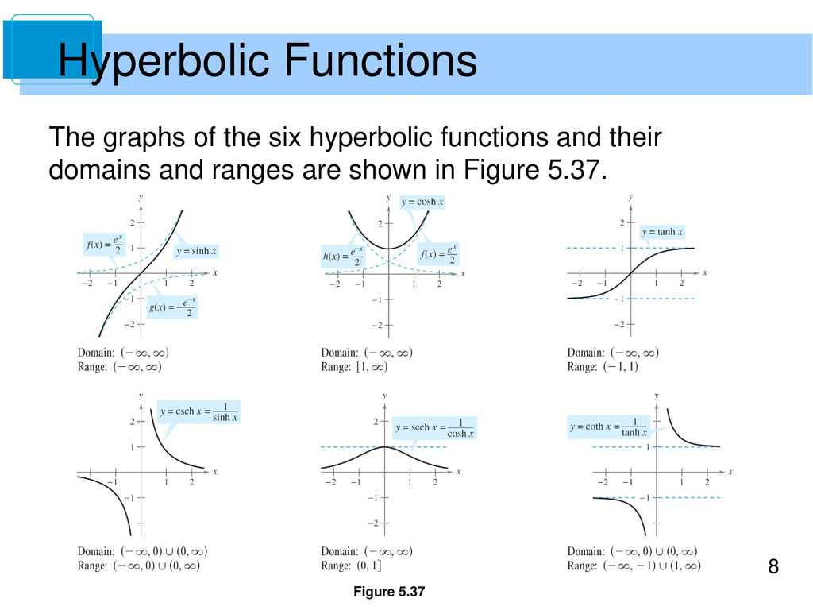

## **Graphs of the Hyperbolic Functions**

Hyperbolic functions—analogous to their trigonometric counterparts—are defined using exponential
functions. They are smooth, continuous, and arise frequently in physics, engineering, and differential equations.

---

---

### **1. Hyperbolic Sine: $\sinh(x)$**

#### **Definition:**

$$
\sinh(x) = \frac{e^x - e^{-x}}{2}
$$

#### **Graph & Properties:**

* **Shape**: Odd function (symmetric about the origin)
* **Range**: $`(-\infty, \infty)`$
* **Domain**: $`(-\infty, \infty)`$
* **Behavior**:

  * Increases without bound as $`x \to \infty`$
  * Decreases without bound as $`x \to -\infty`$
* **Intercept**: Passes through the origin, $`\sinh(0) = 0`$
* **Derivative**: $`\frac{d}{dx} \sinh(x) = \cosh(x)`$

#### **Graph Highlights:**

* Smooth S-curve through origin.
* Lies above the x-axis for $`x > 0`$, below for $`x < 0`$

---

### **2. Hyperbolic Cosine: $\cosh(x)$**

#### **Definition:**

$$
\cosh(x) = \frac{e^x + e^{-x}}{2}
$$

#### **Graph & Properties:**

* **Shape**: Even function (symmetric about the y-axis)
* **Range**: $`[1, \infty)`$
* **Domain**: $`(-\infty, \infty)`$
* **Behavior**:

  * Minimum value of 1 at $`x = 0`$
  * Grows exponentially in both directions
* **Derivative**: $`\frac{d}{dx} \cosh(x) = \sinh(x)`$

#### **Graph Highlights:**

* Looks like an upward-opening parabola, but grows exponentially.
* Represents the shape of a **catenary** (hanging flexible chain).

---

### **3. Hyperbolic Tangent: $\tanh(x)$**

#### **Definition:**

$$
\tanh(x) = \frac{\sinh(x)}{\cosh(x)} = \frac{e^x - e^{-x}}{e^x + e^{-x}}
$$

#### **Graph & Properties:**

* **Shape**: Odd function
* **Range**: $`(-1, 1)`$
* **Domain**: $`(-\infty, \infty)`$
* **Horizontal Asymptotes**:

  * $`y = 1`$ as $`x \to \infty`$
  * $`y = -1`$ as $`x \to -\infty`$
* **Intercept**: Passes through the origin, $`\tanh(0) = 0`$
* **Derivative**: $`\frac{d}{dx} \tanh(x) = \operatorname{sech}^2(x)`$

#### **Graph Highlights:**

* S-shaped curve bounded between −1 and 1.
* Steepest slope at $`x = 0`$.

---

### **Visual Summary Table**

| Function   | Symmetry | Domain              | Range               | Key Feature                  |
| ---------- | -------- | ------------------- | ------------------- | ---------------------------- |
| $`\sinh(x)`$ | Odd      | $`(-\infty, \infty)`$ | $`(-\infty, \infty)`$ | Unbounded, smooth S-shape    |
| $`\cosh(x)`$ | Even     | $`(-\infty, \infty)`$ | $`[1, \infty)`$       | Min at 0, exponential growth |
| $`\tanh(x)`$ | Odd      | $`(-\infty, \infty)`$ | $`(-1, 1)`$           | Bounded, sigmoid shape       |

---

These hyperbolic functions model real-world phenomena such as cable tension, special relativity, 
and heat distribution, and their graphs provide key insight into their behavior.
